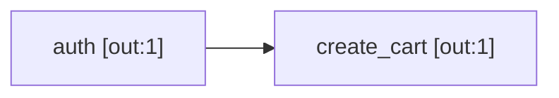

# Draw the graph

Use this procedure to make a Mermaid diagram of the dependency graph. GitHub shows Mermaid diagrams in Markdown files.

## Procedure

1. Add `--diagram` to the command:

   ```bash
   hurl-orchestra --diagram ./tests
   ```

2. Open `diagram.md`. The diagram shows each node with its number of outputs, and its priority if the priority is not 0.
3. To write to a different file, add `--diagram-output`:

   ```bash
   hurl-orchestra --diagram ./tests --diagram-output docs/api-graph.md
   ```

4. To replace a file, add `--diagram-overwrite`. Without it, hurl-orchestra does not change a file that exists.

## Draw the graph of one file

Give the file instead of the directory. The diagram contains the file and its dependencies:

```bash
hurl-orchestra --diagram tests/checkout.hurl --diagram-output -
```

The `-` value writes the diagram to stdout.

## Result


